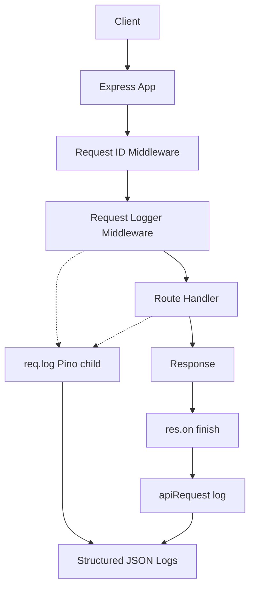

# Observability

This doc explains how logging and request tracing in this project support production debugging and safe operations.

## Case studies

- [Diagnosing Latency and Timeout Behavior with Sentry in Low·sAI](./latency-timeout-case-study.md)
- [Debugging an Unreachable JWT Recovery Flow in Low·sAI](./unreachable-jwt-refresh-flow-case-study.md)

---

## Architecture

- **Request ID Middleware** sets `req.id`, `res.locals.requestId`, and the `X-Request-ID` response header (validates incoming ID or generates one).
- **Request Logger Middleware** attaches `req.log` (Pino child with `requestId` in bindings) and, on `res.on('finish')`, calls `logger.apiRequest()` for one summary line per request.
- **Route handlers** use `req.log`; each line gets `requestId` (and `userId` when set). All output is **structured JSON logs** with redaction and error serialization applied.

---

## Why structured logging matters

**Structured logs** are JSON (or another machine-parseable format) with consistent field names and types. That differs from ad-hoc `console.log` messages or hand-formatted strings.

- **Search and filter** – Log aggregators (Datadog, CloudWatch, etc.) can index fields like `statusCode`, `route`, `requestId`, and `eventType`. You can find “all 5xx errors on POST /api/…” or “every log for request X” without regex over free text.
- **Alerts and dashboards** – You can alert on `level: "error"` or `statusCode >= 500`, and build dashboards by route, status, or duration.
- **One schema** – The app uses fixed messages (e.g. `"HTTP request completed"`) and top-level fields (`route`, `method`, `duration`, …). That keeps the log schema predictable so pipelines and queries stay simple.

This project uses **Pino** for structured JSON output; the wrapper (`logger`) keeps a stable API while Pino handles formatting and levels.

---

## How request IDs help debugging

Every request gets a **request ID** (`req.id`), set by middleware from the `X-Request-ID` header (if valid) or generated. It is sent back in the `X-Request-ID` response header and is available as `res.locals.requestId`.

- **Correlate everything for one request** – A single user request can trigger many log lines (auth, validation, DB, response). Searching by `requestId` returns every log entry for that request, so you can see the full story instead of guessing which lines belong together.
- **Trace failing requests** – When a user reports an error, they (or your frontend) can send the `X-Request-ID` from the response. You look up that ID in your logs and get the full trace: route, status, duration, and any errors or context logged along the way.
- **Request-scoped logger** – Handlers use `req.log`, which attaches `requestId` (and `userId` when set) to every log line automatically, so you don’t have to pass it manually.

Request IDs are validated (length, safe characters); invalid values are rejected and a fresh ID is generated so clients can’t inject bad or misleading IDs.

---

## How redaction prevents credential leaks

Logs often include request/response data or error context. If that data is copied into logs as-is, **passwords, tokens, API keys, or cookies** can end up in log streams, dashboards, or support tools and leak to people or systems that shouldn’t see them.

**Redaction** ensures sensitive fields never appear in log output:

- **Pino** – The logger is configured with a `redact` list (e.g. `password`, `token`, `authorization`, `cookie`, and nested paths). Those keys are replaced with `[Redacted]` in the JSON that Pino writes, so they never reach stdout, files, or log aggregators.
- **In-memory buffer** – The same sensitive keys are redacted in the in-memory log buffer (e.g. for `getLogs()` or debug endpoints), so credentials are never exposed there either.

So you can safely log “request body” or “error context” for debugging; only the redacted form is stored or shipped, and credential leaks from logs are avoided.
