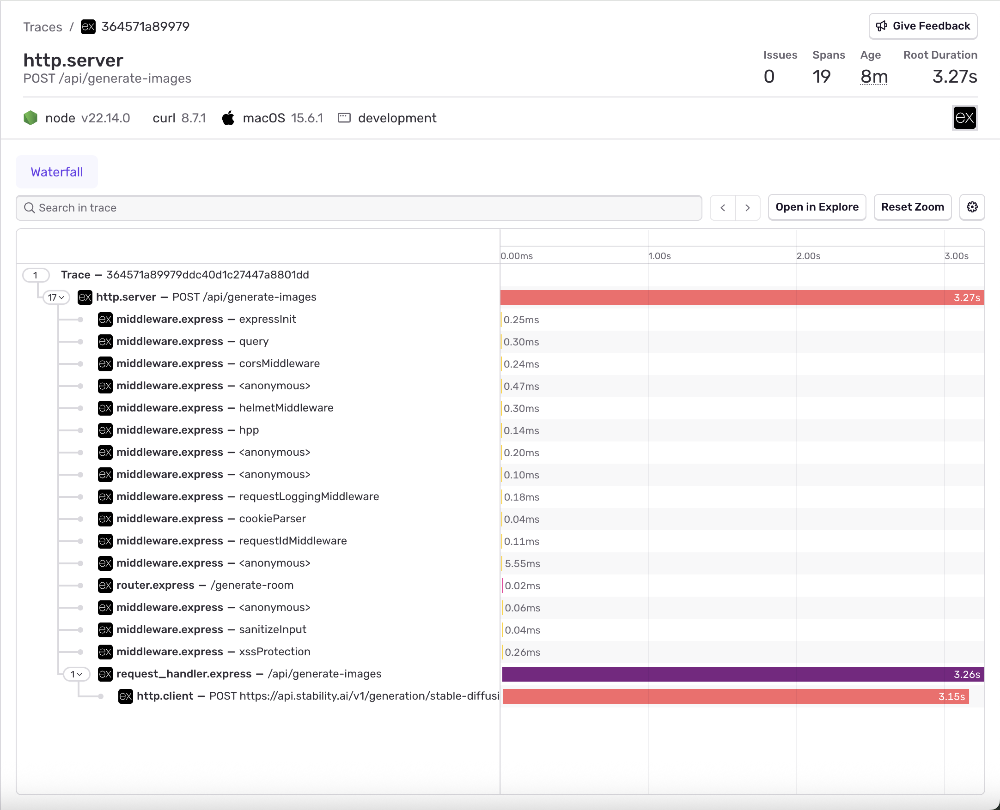
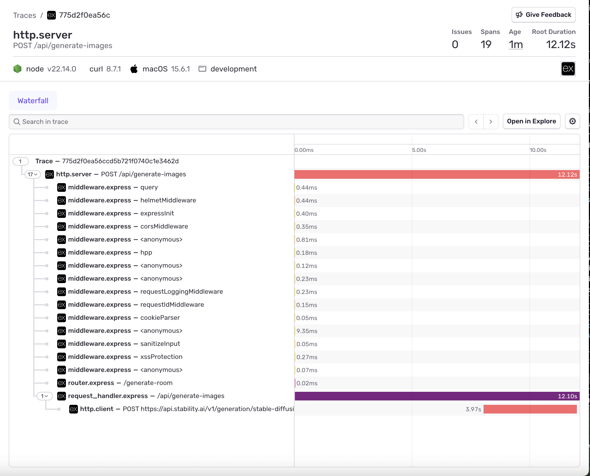
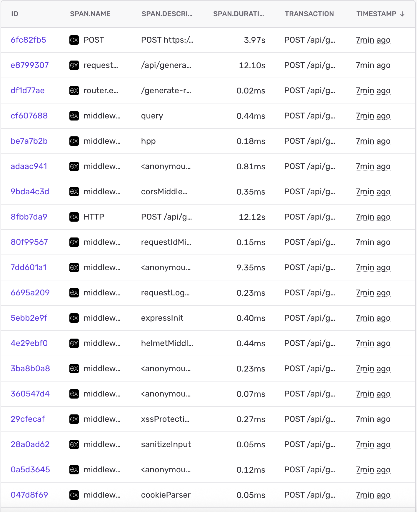
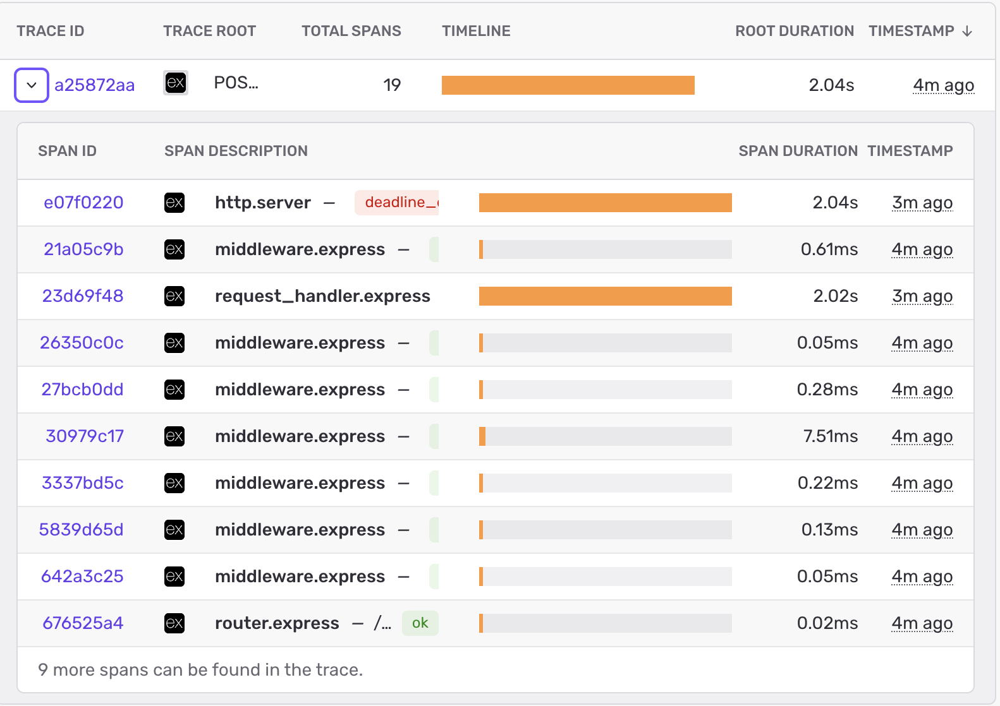

# Diagnosing Latency and Timeout Behavior with Sentry in Low·sAI

As I started shifting toward support/production-style engineering, I wanted to move beyond “I built a feature” and actually demonstrate how I debug and reason about systems under real conditions.

So I took a core endpoint in Low·sAI—`POST /api/generate-images`—and treated it like a production system: instrument it, break it deliberately, and explain what happens.

---

## Setup

I integrated Sentry into my Node/Express backend with:

- error tracking
- request tracing
- performance monitoring

I also added structured logging with request IDs and mid-route instrumentation around the Stability API call so I could correlate:

- full request traces
- span-level timing
- structured logs

---

## Test 1 — Where is the latency actually coming from?

### Baseline (Normal Behavior)



**What this shows:**
- Total request time: ~3.3s
- Stability API call: ~3.1s
- Nearly all latency is spent in the external API

> Initial assumption: the endpoint is slow because the external API is slow.

---

### Introduced Delay (Controlled Experiment)

I added an 8-second artificial delay *before* the outbound API call:

```js
await new Promise((r) => setTimeout(r, 8000));
```




**What changed:**
- Total request time: ~12.1s
- Stability API call: ~3.9s

> The external API timing stayed roughly the same, while total request time increased by ~8 seconds.

---

### Supporting Evidence — Span Data




**Across multiple requests:**
- Stability API consistently completes in ~3–5 seconds

---

### Conclusion

The slowdown was not in the dependency—it was inside my own request path.

> The added latency occurred before the upstream API call, not inside it.

This was verified by correlating:
- trace timelines
- span-level data
- structured logs

---

### Secondary insight

The trace showed the request was slow, but didn’t explicitly show where the extra time was spent.

> The delay appeared as unaccounted time inside the request handler.

This highlighted a gap:

> Observability without sufficient instrumentation can show *that* something is slow, but not *why*.

---

## Test 2 — What happens when the dependency exceeds our tolerance?

To test failure behavior, I reduced the Axios timeout:

```js
timeout: 2000;
```


Since the Stability API normally takes ~3–5 seconds, this forces a timeout.

---

### Result



- Stability request failed with `ECONNABORTED` after ~2016 ms
- Backend returned a `504 Gateway Timeout`
- Total request duration: ~2.0 seconds

From logs:
- `stability_request_start`
- `stability_request_failed`
- `stabilityDuration: ~2000ms`

---

### Conclusion

> When the dependency exceeded the configured timeout budget, the system failed fast and returned a clear 504 response.

This prevents:
- hanging requests
- misleading success responses
- silent failures

---

## Unexpected finding — Logging inconsistency

While adding instrumentation, I noticed malformed logs like:

```js
"0": "A",
"1": "p",
"2": "p",
```


The cause:

> Different logger wrappers were using inconsistent argument conventions (message-first vs. object-first).

Specifically:
- request-scoped logs (`req.log`) were fixed
- central error handler logs were still reversed

---

### Fix

I standardized all logging calls to match Pino’s expected format:

```js
log.error(errorContext, 'Application Error');
```

instead of:

```js
log.error('Application Error', errorContext);
```


---

### Why this matters

> Bad logging structure makes traces and logs much harder to correlate.

Fixing this ensured logs could be reliably used alongside traces.

---

## What I took away

### 1. A slow endpoint is not the same as a slow dependency
Tracing alone can mislead you if you don’t validate where time is actually spent.

### 2. Observability tools are only as good as your instrumentation
Without proper spans and structured logs, you lose the ability to explain system behavior.

---

## Final result

This exercise gave me a repeatable debugging workflow:

- introduce controlled failure or latency
- observe behavior in traces
- validate with logs
- isolate the cause
- confirm the fix

That’s what I’m trying to demonstrate—not just building features, but **debugging real systems and explaining what’s happening clearly**.
