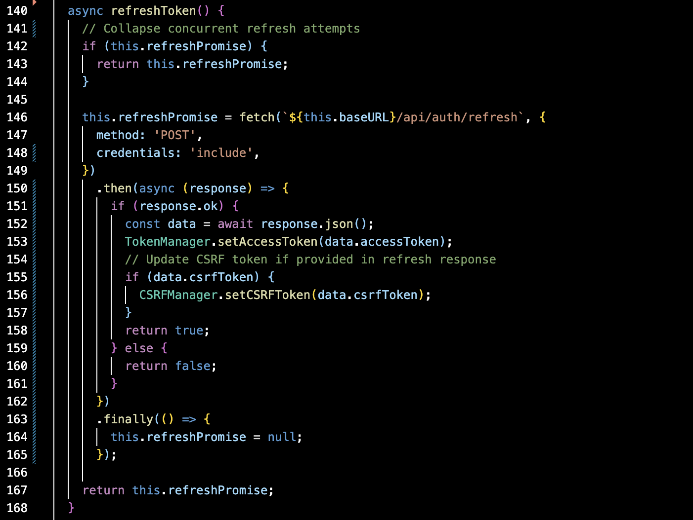
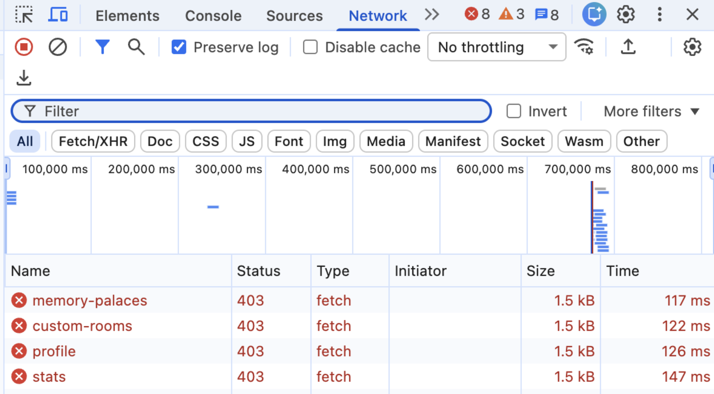
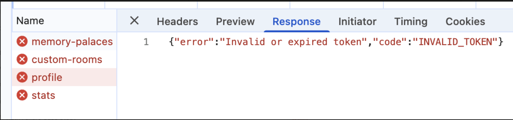
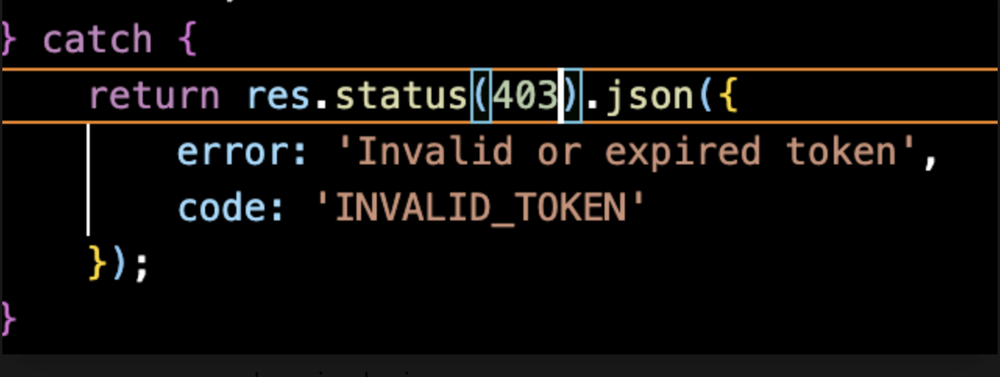
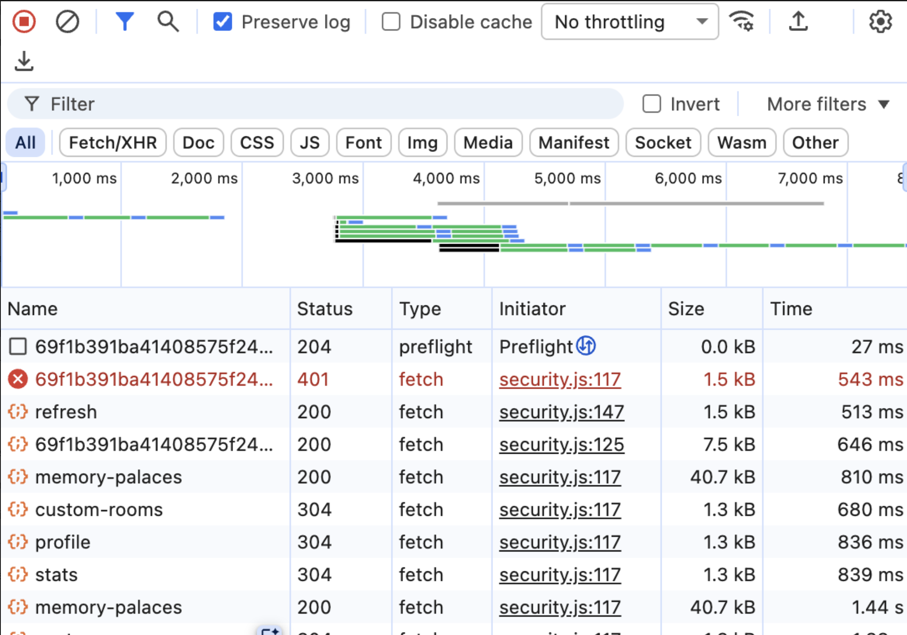

# Debugging an Unreachable JWT Recovery Flow in Low·sAI

As I started shifting toward support/production-style engineering, I wanted to move beyond “authentication works” and actually examine how the system behaved under failure conditions.

JWT refresh flows are a common source of intermittent production auth issues:
- expired sessions
- repeated login prompts
- inconsistent `401` failures
- refresh loops

In this case, the refresh implementation itself was correct, but one expired-token failure path never reached it.

So I treated Low·sAI’s authentication flow like a production system: shorten token lifetimes, trigger concurrent failures intentionally, and trace the resulting behavior.

---

## Setup

Low·sAI uses:
- JWT access tokens
- refresh-token cookies
- protected API endpoints
- a client-side `SecureAPIClient` wrapper for authenticated requests

I temporarily reduced the access-token lifetime in development:

```js
JWT_EXPIRES_IN=30s
```

This made token expiration reproducible on demand.

I then triggered multiple protected requests simultaneously after token expiration to observe:
- how expired tokens were handled
- whether refresh requests executed correctly
- whether concurrent failures produced duplicate refresh attempts

---

## Initial Goal — Test Concurrent Refresh Behavior

Before testing for race conditions, I reviewed the existing refresh logic.

The client already used an in-memory `refreshPromise` intended to collapse concurrent refresh attempts within one `SecureAPIClient` instance.



> Initial assumption: concurrent expired requests should produce one shared refresh request.

---

## Test 1 — What actually happens when the token expires?

After waiting for the access token to expire, I triggered several protected requests simultaneously.



**What this showed:**
- multiple protected endpoints failed simultaneously
- all failures returned `403`
- no `/refresh` request occurred

At first glance, this looked like the refresh flow itself might be broken.

---

## Impact

Potential user symptoms:
- authenticated UI appearing “stuck”
- repeated failed API requests
- forced manual re-login despite valid refresh cookie

Detection signals:
- clustered `403 INVALID_TOKEN` responses (before fix)
- absence of `/refresh` requests in Network traces

Severity:
- moderate in long-lived sessions
- especially noticeable after idle periods or multi-request dashboard loads

---

### Supporting Evidence — Response Payload

Inspecting the failed responses showed:



```json
{
  "error": "Invalid or expired token",
  "code": "INVALID_TOKEN"
}
```

---

## Investigation — Why wasn’t refresh executing?

I traced the auth behavior through the Express middleware.

### Server Middleware


(Behavior before fix; expired-token responses now return `401`.)

```js
if (!token) {
  return res.status(401).json({
    code: 'MISSING_TOKEN'
  });
}

if (isTokenBlacklisted(token)) {
  return res.status(401).json({
    code: 'TOKEN_BLACKLISTED'
  });
}

try {
  verifyToken(token);
  next();
} catch {
  return res.status(403).json({
    code: 'INVALID_TOKEN'
  });
}
```

This revealed an important mismatch:

- missing token → `401`
- blacklisted token → `401`
- expired token → `403`

---

### Client Refresh Logic

The client-side refresh flow only executed on `401` responses:

```js
if (response.status === 401) {
  const refreshed = await this.refreshToken();
}
```

---

## Root Cause

> The refresh system itself was functioning correctly, but one expired-token failure path made the recovery flow unreachable.

Expired access tokens returned `403 INVALID_TOKEN`, while the client only attempted refresh on `401 Unauthorized`.

As a result, requests carrying expired bearer tokens bypassed the refresh path entirely.

---

## Important Distinction

This was not a “broken refresh” bug.

The failure occurred earlier in the request lifecycle:
- expired bearer tokens reached the API
- the middleware returned `403 INVALID_TOKEN`
- the client never entered the refresh branch

In other words:
- recovery behavior existed
- but one valid failure mode could not reach it

---

## Reproduction Path vs Normal Behavior

The manual DevTools repro always sent an expired bearer token directly.

In the normal application flow, `SecureAPIClient` may omit the `Authorization` header once the client already considers the token expired, which can instead produce a `401 MISSING_TOKEN` response and still allow the refresh flow to execute.

The mismatch primarily affected cases where:
- an expired bearer token was explicitly sent to the API
- client/server clocks disagreed
- or an otherwise invalid token bypassed the client’s local expiration check

---

## Fix

I aligned the server/client auth contract by changing expired-token responses from:

```js
return res.status(403).json({
  code: 'INVALID_TOKEN'
});
```

to:

```js
return res.status(401).json({
  code: 'INVALID_TOKEN'
});
```

Documented in [API_DOCUMENTATION.md → Error Handling](../API_DOCUMENTATION.md#error-handling).

---

## Verification — Does refresh now execute correctly?

After the change, I repeated the expired-token test.



**What changed:**
- expired protected request returned `401`
- `/refresh` executed successfully
- original request retried successfully
- additional protected requests resumed normally

The request chain became:

```text
expired request → 401
refresh request → 200
retried request → 200
```

---

## Secondary insight — Existing concurrency protection already worked

Once the refresh path became reachable, the original concurrency test could finally be evaluated.

The existing `refreshPromise` behavior correctly collapsed concurrent refresh attempts within one client instance.

> Multiple failed requests shared one in-flight refresh request instead of triggering duplicate `/refresh` calls.

---

## Additional finding — Remaining edge cases

The investigation also surfaced a narrower concurrency limitation.

The refresh coordination exists:
- per `SecureAPIClient` instance
- not globally across the application

This means:
- multiple client instances
- or multiple browser tabs

could still issue parallel refresh requests.

However, the classic rotating-refresh-token race condition was not present because:
- refresh tokens are not rotated on `/refresh`
- existing refresh cookies remain valid until expiration

That reduces refresh invalidation races, though it also means a stolen refresh token remains usable until expiry unless server-side revocation or token-family tracking is added.

---

## What I took away

### 1. A working recovery flow can still be unreachable
The refresh system itself was implemented correctly, but a small mismatch in HTTP semantics meant one expired-token path could not reach the recovery flow.

### 2. Runtime behavior matters more than assumptions
Reading the code suggested refresh coordination already existed. Testing the actual request flow revealed a different failure earlier in the chain.

### 3. Production debugging often means correlating multiple layers
The issue only became obvious after combining:
- runtime Network traces
- response payloads
- middleware behavior
- client retry logic

No single component explained the failure on its own.

---

## Final result

This exercise gave me a much better framework for investigating auth and recovery behavior:

- create controlled failure conditions
- observe runtime request behavior
- trace middleware and client logic together
- isolate where recovery breaks down
- verify the fix with repeated tests

That’s what I’m trying to demonstrate—not just implementing authentication, but **debugging distributed request behavior and explaining why systems fail under real conditions**.
